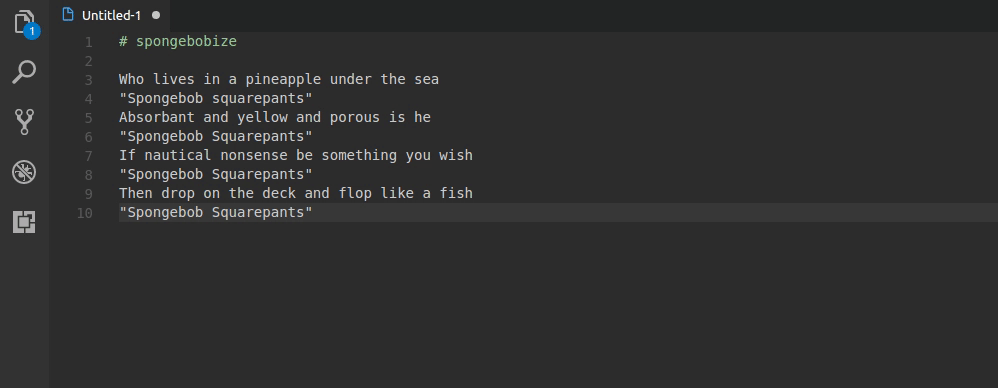

# spongebobize - Change case sPOnGeBOb

## Features

Adds a `Change case sPOnGeBOb - Spongebobize` command to your editor.

## Requirements

- VS Code
- Living under the sea

## Extension Settings

None.

## Known Issues

None, yet!

## Release Notes

### 0.1.0

- Added a .gif, beCaUSE gifs are impOrTANt.